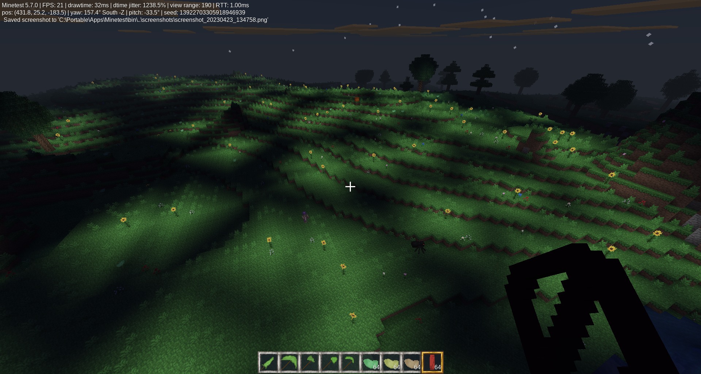

# Why?
A modpack of random mods, mostly for MineClone (some support Minetest Game), that I made just because I wanted to: Fake Liquids, Falling Block Tool, Flying Sausage\*, Ghost Blocks, Lava Sponge\*, Meat Blocks\*, Slime Things\*, Small "Why?" Things\*\*, Sound Machine, Sticky Things\*\*, Useless Beans, Useless Green Potatoes, and Why Schematic.

\* Does not support Minetest Game
\*\* Partially supports Minetest Game

Apparently, several of them are existing MineCraft mods, and at least one (Ghost Blocks) is already a Minetest mod.

`why:` aliases are registered for every item in the modpack (except for Ghost Blocks), so you can type `/giveme why:flying_sausage` instead of `/giveme flying_sausage:flying_sausage`.

## Licenses/attribution
All code in this modpack is licensed under GPLv3+. All burnt meat textures, besides the blocks and sausage, are modified versions of MineClone meat textures. The glue and useless bean liquid bucket textures are modified versions of MineClone's water bucket. All other textures in the modpack are completely my own. All textures (my own and MineClone's) are licensed under CC BY-SA 3.0.

**Links to licenses:**
[GPLv3](https://www.gnu.org/licenses/gpl-3.0.en.html)
[CC BY-SA 3.0](https://creativecommons.org/licenses/by-sa/3.0/legalcode)

<h2>Mod details</h2>

### Fake Liquids
A mod that adds solid liquid blocks. They can be crafted by placing glass to the left, right, and bottom of the filled bucket (basically making a glass bottle with the bucket inside). Also adds fake lava and fake water (which look identical but their functions are swapped). To craft them, brew lava, water, or river water buckets with fermented spider eyes (in Minetest Game, craft the bucket with a Mese crystal). Also makes MCL's milk an actual placeable liquid, which might *eventually* clear effects (but doesn't at the moment).

### Falling Block Tool
Adds a tool crafted with sticks, sand, and gravel that can make any breakable block/node fall by right-clicking on it.

### Flying Sausage*
Adds Cooked Elytras and Burnt Elytras (both incredibly good foods), as well as a Flying Sausage (an even better food, crafted by surrounding a Burnt Elytra with Burnt Sausage Blocks). Crafting a Flight Stomach Accessor (by mixing a chest and a burnt sausage) and putting a Flying Sausage into it will grant you the `fly` privilege. The Flying Sausage will remain in your Flight Stomach even if you get rid of the Flight Stomach Accessor or die.

### `get_group_items`
A mod that adds a function that could potentially be used in other mods. It simply searches through every item and returns a table of each item that matches each group passed to it.

### Ghost Blocks
A mod that creates Ghost Blocks, effectively normal blocks with no collision. They can be created using the "Ghostifier", which can be crafted by surrounding a ghast tear with glass blocks. Placing Ghost Blocks in the Ghostifier will convert them back to normal blocks.

More details

MineClone's chests, ender chests, shulker boxes, item frames, beacons, grindstones, anvils, barrels, brewing stands, furnaces (any type), hoppers, and probably other items don't work normally as ghost blocks. Armor stands work, but the armor is not shown. Anvils still fall, break items, and damage players/mobs. Beehives and bee nests probably don't work, but I don't know how to test them. Jukeboxes *work* (they play discs you put in them), but it's impossible to get music discs back from them, even by breaking them.

Anything with multiple states (buttons, doors, trapdoors, observers, powered rails, furnaces, Minetest's chests, etc.) or multiple blocks (beds, doors, etc.) will not work correctly, instead turning into the "real" version when changed. Anything that can turn into another block will do so. In other words, stripping a ghost log will turn it into a normal (stripped) log.

Ghost scaffolding instantly turns into normal scaffolding when placed.

Probably a bunch of other things I haven't tested.

Most blocks should still be usable in *group* crafting recipes (since I'm not overriding most groups), meaning that ghost cobble will still be usable in any crafting recipe that uses group:cobble (such as furnaces/tools).

### Lava Sponge*
Adds a lava sponge to MineClone. Lava sponges act exactly like normal sponges, but soak up lava instead of water. To return them to un-lava-logged sponges, use them as fuel in a furnace. They are completely safe to touch when lava-logged, mostly because I'm lazy. To craft a lava sponge, surround a regular sponge with netherrack.

### Meat Blocks*
Adds craftable, cookable, edible meat blocks to MineClone. Also adds burnt meat and sausage. Eating burnt meat sets you on fire. You can craft a meat block with any kind of meat (besides tropical fish/clownfish and pufferfish) simply by placing that meat in a 3x3 square. You can cook raw meat blocks to get cooked ones, and cooked ones to get burnt ones. Raw cod blocks are flammable because they are.

### Slime Things*
Adds slime slabs, stairs, pressure plates, and buttons.

### Small "Why?" Things**
A few small additions:
* Sunflowers glow (MCL)
* Wool is bouncy (but intentionally does *not* block fall damage)
* You can craft blue feathers with blue dye and feathers (MCL).
* Papyrus/sugar cane, cactus, and bamboo (MCL) now have no height limit.
* There are craftable barriers that are breakable (same hardness as obsidian). The barriers are crafted by surrounding obsidian with glass.

### Sound Machine
Adds a block that can create any sound in the game (with a few buttons for presets and pitch controls). It will play the sound when a button in the formspec is clicked, when the block is punched, or when it is powered by a redstone signal. It can be crafted by placing copper ingots around black concrete (or black wool in Minetest Game). Also adds a Portable Sound Machine, an item (not a block) that opens the same formspec when right-clicking and plays the last sound when left-clicking.

### Sticky Things**
Adds glue and sticky blocks, which slow down players. Craft glue by combining a flower with a water bucket (a quick Google search said that one common recipe for glue was flour and water, and... pun). Craft sticky blocks mixing soul sand and ice. Sticky blocks depend on a mod included in MCL, and are therefore not in Minetest Game.

### Useless Beans
Beans... that are useless. They grow everywhere. Annoy everyone by filling their inventories with useless beans! For added irritation, you can put one useless bean into a crafting table and get 64. Craft useless bean tools, smelt them into beangots (useless bean ingots), flood the world with useless bean liquid, and more!

### Useful Green Potatoes
Potatoes... that are green and useful. They grow everywhere, and look identical to useless beans. Craft useful green potato tools, smelt them into useful green potato ingots, flood the world with useful green potato liquid, and more!

### `why_init`
Contains basic setup stuff, as well as a few functions used by multiple mods. I mostly created it for annoying dependency reasons. All other Why mods depend on it, ensuring that it loads before all of them.

### Why Schematic
* Adds a simple structure: the word "Why?" spelled out with Solid Useless Bean Liquid. It can appear pretty much anywhere in the overworld.

Well-hidden (?) secret:

You can craft an elytra with meat blocks. Just put diamond blocks in the corners, a burnt steak block in the middle, a burnt fish/cod block on top, a burnt salmon block on the bottom, a burnt rabbit block on the left, and a burnt sausage block on the right. I just hope nobody chooses to read this Markdown file in a plain text editor, or this will be incredibly obvious.

<h2>Screenshots</h2>

# Changelog
### v7.0
Honestly, it's likely that there are bugs now. I took a LONG break in the middle of this update (well, not exactly a break, since I did release the biggest update ExchangeClone's ever had), so I kind of forgot what I was doing.
* Added achievements/advancements/awards (many are MCL-specific, a few are MCL2-specific for annoying reasons)
* The changelog now shows more recent updates first
* Started adding v's to versions.
* Ghost Blocks
    * The Ghostifier no longer uses node timers (meaning there is now no delay for ghostification).
    * ~~The Ghostifier sort of works with MCL hoppers (though for some unknown reason, it's not triggered when items are inserted)~~
        * I wrote that about two months ago, before MineClone2 and Mineclonia both changed their hopper API's and broke this. I might get around to fixing it eventually.
    * The Ghostifier will not delete unghostifiable nodes.
    * More nodes should be ghostifiable now.
* Lava Sponge
    * Now supports Minetest Game!
* Small Why Things
    * Sugar cane and papyrus are now climbable.
### 6.1
* Fixed a bug with brewing (thanks @jiffygist!)
### 6.0
* Why now supports Mineclonia.
* `why.mineclone` changed to `why.mcl` (not a notable change unless for some reason you made a mod that depends on it).
* Added Falling Block Tool
    * Can make any breakable block/node fall (like sand) by right clicking on it.
* Meat Blocks
    * Raw Fish Blocks (cod, not salmon) are now flammable. Why? Because Why.
* Small Why Things
    * Fixed an issue where craftable barriers caused regular barriers to also display as yellow.
    * Cactus, Sugar Cane/Papyrus, and Bamboo now have no height limit.
* Sound Machine
    * The portable sound machine now plays the selected sound on left click.
    * Both versions now refresh the formspec when selecting a sound (so the "custom sound" field displays correctly)
* Sticky Things
    * Fixed a potential issue with the glue crafting recipe in MineClone
### 5.2
* Fake Liquids:
    * [MineClone] Attempting to brew fake liquids no longer crashes the server.
    * This crash has probably happened since 3.0, when there were so many changes (since I added MTG compatibility) that I didn't test everything.
### 5.1
* Lava Sponge
    * I really should have tested before releasing.
    * The lava sponge/bucket recipe now actually does what it's supposed to.
### 5.0
* Fixed a couple issues in the readme.
* Moved the changelog from `changelog.txt` to here.
* Added Flying Sausage (MineClone only, depends on Meat Blocks):
    * Probably just disable the mod if most of the players are able to fly (i.e. a creative server).
    * Adds Cooked and Burnt Elytra (incredibly good food).
    * Surrounding a Burnt Elytra with Burnt Sausage Blocks makes a Flying Sausage (incredibly-er good food)
    * Combining a Burnt Sausage with a chest gives the Flight Stomach Accessor, an inventory slot specifically for flying sausage.
    * Having a Flying Sausage in your Flight Stomach grants you the flight privilege.
    * Use `/ignore_sausage` (requires `privs` privilege) to toggle whether the sausage will affect you (DO THIS if you want to be able to fly in creative mode, since the fly privilege is revoked every time you leave the server otherwise).
    * The Flying Sausage will remain in your Flight Stomach even if you get rid of the Flight Stomach Accessor or die.
* Lava Sponge:
    * You can now combine an empty bucket with a lavalogged sponge to transfer the lava to the bucket.
* Meat Blocks:
    * The setting has been changed from "x meatballs spawn every second per player" to "1 meatball spawns every x seconds per player," (x can be a decimal) because there were too many.
* Ghost Blocks:
    * Ghost Blocks can now be unghostified by putting them back into the Ghostifier.
### 4.0
* Added Useful Green Potatoes:
    * Look identical to Useless Beans
    * Tools/armor basically copied from iron/steel
    * Useful Green Potato Liquid is identical to water but disables drowning
    * Golden Useful Green Potato is identical to MineClone's golden apple (or just heals you a lot in Minetest Game)
    * Useful Green Potato Block heals players that fall on it (healing is 2.5x what normal fall damage would be)
        * Known issue: Landing near one is enough to trigger the healing. This is Minetest's fault, and it's either that or forcing players to land in the exact center.
    * Useful Green Potato Ingot Blocks multiply fall damage slightly more than Useless Bean Ingot Blocks, and also damage players at 3 hearts/second.
* Useless Beans:
    * Biome requirements removed! Useless Beans can now spawn anywhere! (Honestly, the biome requirements didn't really work that well to begin with, for some reason)
* Sticky Things:
    * Players cannot jump while standing on Sticky Blocks.
### 3.1
* Added `why_init`:
    * Set namespace and added why:<item> aliases
### 3.0
* Added Minetest Game support for all mods except Lava Sponge, Meat Blocks, and Slime Things
    * Some features of other mods such as Sticky Blocks are also not in Minetest Game.
* Only one global varaiable (`why`) is created.
* Ghost Blocks:
    * Improved the Ghostifier wield_image and inventory_image to be more translucent.
* Meat Blocks:
    * \[MineClone\] Meatballs fall from the sky when it rains
    * Burnt meat textures are now automatically generated
* Fake Liquids:
    * \[MineClone\] Milk is now an actual, placeable liquid. It's basically nonrenewable water. I may eventually make it clear player effects when touching it.
* Small Why Things:
    * Craftable Barriers are now yellow to differentiate them from normal barriers.
    * \[MineClone\] Added blue feathers (completely useless)
### 2.3
* Useless Beans:
    * Added Useless Bean Armor.
### 2.2
* Sticky Things:
    * Glue bucket recipe no longer returns bucket.
### 2.1
* Useless Beans:
    * Added "group:useless" to all useless bean items.
### 2.0
* Added a changelog to log changes.
* Changed version numbers to x.x instead of x.x.x.
* Sound Machine:
    * Added pitch controls.
    * Added a "Sound Machine" block (basically a sound machine that acts like a note block).
    * Renamed the original Sound Machine to "Portable Sound Machine."
    * The Sound Machine and the portable version can be crafted from each other.
    * Changed the crafting recipe of the Sound Machine to black concrete surrounded by copper ingots (copper needs more uses).
* Fake Liquids:
    * Solid liquid recipes now return the bucket.
    * Solid liquids do not take nearly as long to break (for some reason I made it as long as obsidian).
    * Any solid liquid with `group:lava` will set players on fire and damage them.
        * Mobs are not damaged by solid liquids unless inside them (would require MineClone change or a lot of work/lag), but ghost solid liquids work.
    * Solid liquid blocks (including ghost versions) are now closer to actual liquid blocks (swimming, drowning, etc.)
    * Solid liquid blocks are automatically registered (depends on dependencies and mod load order).
    * Solid liquid blocks now interact to produce cobble/stone/obsidian.
    * Added Fake Lava and Fake Water, which look identical to lava and water but their functions are reversed. They are created by brewing water/river water or lava buckets with a fermented spider eye.
    * Any fake liquid with `group:water` will evaporate in the Nether (assuming you use the bucket).
* Ghost Blocks:
    * Solid liquids are now ghostifiable.
* Slime Things:
    * Inner stairs are now bouncy/transparent (I just completely forgot about them)
    * Upper/double slabs and inner/outer stairs no longer appear in the creative inventory
### 1.0.1
* Fixed to satisfy release requirements.
### 1.0.0
* Initial release.