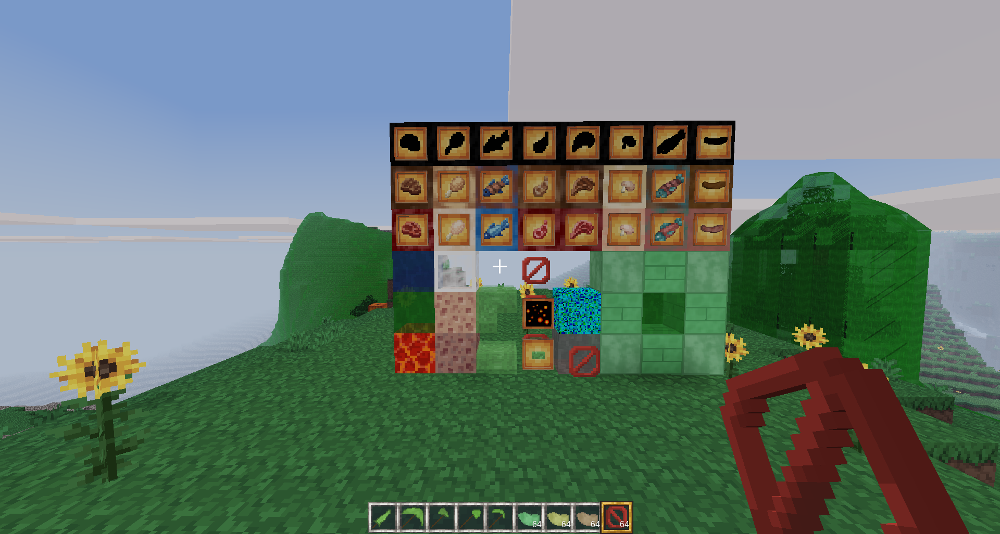

# Why?
A modpack of MineClone mods that I made just because I wanted to: Fake Liquids, `get_group_items`, Ghost Blocks, Lava Sponge, Meat Blocks, Slime Things, Small "Why?" Things, Sound Machine, Sticky Things, and Useless Beans.
Apparently, several of them are existing MineCraft mods, and at least one (Ghost Blocks) is already a Minetest mod.

## Licenses/attribution
All code in this modpack is licensed under GPLv3+. All burnt meat textures, besides the blocks and sausage, are modified versions of MineClone meat textures. The glue and useless bean liquid bucket textures are modified versions of MineClone's water bucket. All other textures in the modpack are completely my own. All textures (my own and MineClone's) are licensed under CC BY-SA 3.0.

**Links to licenses:**
[GPLv3](https://www.gnu.org/licenses/gpl-3.0.en.html)
[CC BY-SA 3.0](https://creativecommons.org/licenses/by-sa/3.0/legalcode)

<h2>Mod details</h2>

### Fake Liquids
A mod that adds solid water, river water, and lava blocks. They can be crafted by placing glass to the left, right, and bottom of their respective buckets (basically making a glass bottle with the bucket inside).

### `get_group_items`
A mod that adds a function that could potentially be used in other mods. It simply searches through every item and returns a table of each item that matches each group passed to it.

### Ghost Blocks
A mod that creates Ghost Blocks, effectively normal blocks with no collision. They can be created using the "Ghostifier", which can be crafted by surrounding a ghast tear with glass blocks.

More details

MineClone's chests, ender chests, shulker boxes, item frames, beacons, grindstones,
anvils, barrels, brewing stands, furnaces (any type), hoppers, and probably other
items don't work normally as ghost blocks. Armor stands work, but the armor is
not shown. Anvils still fall, break items, and damage players/mobs. Beehives
and bee nests probably don't work, but I don't know how to test them. Jukeboxes
*work*, but it's impossible to get music discs back from them, even by breaking
them.

Anything with multiple states (buttons, doors, trapdoors, observers, powered
rails, command blocks, etc.) or multiple blocks (beds, doors, etc.) will not
work correctly, instead turning into the "real" version when changed.

Anything that can turn into another block will do so. In other words, stripping
a ghost log will turn it into a normal (non-stripped) stripped log.

Ghost scaffolding instantly turns into normal scaffolding when placed.

Most blocks should still be usable in *group* crafting recipes (since I'm not
overriding most groups), meaning that ghost cobble will still be usable
in any crafting recipe that uses group:cobble (such as furnaces/tools).

If you want to see inside the ghost blocks, use third-person view. As long
as the camera is inside a ghost block, you should be able to see through them.
This makes ghost blocks double as x-ray blocks.

### Lava Sponge
Adds a lava sponge to MineClone. Lava sponges act exactly like normal sponges, but soak up lava instead of water. To return them to un-lava-logged sponges, use them as fuel in a furnace (though the lava is lost). They are completely safe to touch when lava-logged, partly because I'm lazy. To craft a lava sponge, surround a regular sponge with netherrack.

### Meat Blocks
Adds craftable, cookable, edible meat blocks to MineClone. Also adds burnt meat and sausage. Eating burnt meat sets you on fire. You can craft a meat block with any kind of meat (besides tropical fish/clownfish and pufferfish) simply by placing that meat in a 3x3 square. You can cook raw meat blocks to get cooked ones, and cooked ones to get burnt ones.

### Slime Things
Adds slime slabs, stairs, pressure plates, and buttons.

### Small "Why?" Things
A few of small additions: glowing sunflowers, bouncy wool, and craftable barriers. The barriers are crafted by surrounding obsidian with glass.

### Sound Machine
Adds an item that can create any sound in the game (with a few buttons for presets). It can be crafted by placing jukeboxes in a 2x2 square.

### Sticky Things
Adds glue and sticky blocks, which slow down players. Craft glue by combining a flower with water (a quick Google search said that one common recipe for glue was flour and water, and... pun). Craft sticky blocks mixing soul sand and ice.

### Useless Beans
Beans... that are useless. They can be found in desert, mesa, and jungle biomes . Annoy everyone by filling their inventories with useless beans! For added irritation, you can put one useless bean into a crafting table and get 64. Craft useless bean tools, smelt them into beangots (useless bean ingots), flood the world with useless bean liquid, and more!

Well-hidden (?) secret:
You can craft an elytra with meat blocks. Just put diamond blocks in the corners, a burnt steak block in the middle, a burnt fish/cod block on top, a burnt salmon block on the bottom, a burnt rabbit block on the left, and a burnt sausage block on the right. I just hope nobody chooses to read markdown files in a plain text editor, or this will be incredibly obvious.

<h2>Screenshots</h2>

